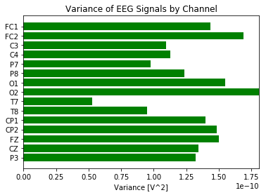
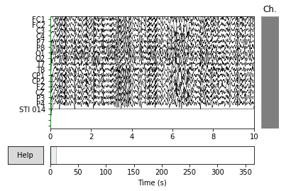
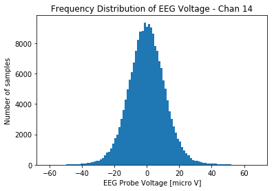
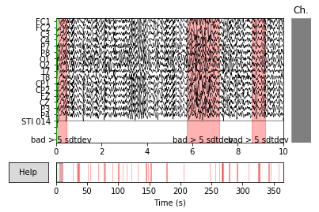

# MNE Analysis Preprocessing
## *BCI Science Fair project*
Caitlin van Zyl and Jacqui van Zyl

This notebook runs the standard preprocessing.  It uses the `raw.fif` file created by the notebook `1-LoadandPreprocess.ipnb` 

The steps are:
1. For each individual trial:
  1. Load the file into `raw` structure
  1. Checking and cleaning
    1. Statistical inspection of the data
    1. Visual inspection of the data
    1. Annotating all bad data
2. Combine the different trials into a single dataset
1. Extract the epocs
  
 

```python
#imports
import mne
from mne import io
from mne.datasets import sample


import numpy as np
import matplotlib.pyplot as plt
from scipy.misc import imread
from scipy import signal as sig
import csv
import sys, math
%matplotlib notebook


# Constants
EEG_CONVERSION = 4.5 / ((float)(pow(2, 23)-1)) /24  #this converts to volts
SEX_FEMALE = 2
SEX_MALE = 1
HANDEDNESS_RIGHT = 1
HANDEDNESS_LEFT = 2

CH_NAMES_PROTOTYPE_1 =['Fp1', 'Fp2','C3','C4','P7','P8','O1','O2',
              'F7', 'F8', 'F3','F4', 'T7','T8','P3','P4','STI 014']


CH_NAMES_PROTOTYPE_2 =['Fp1', 'Fp2','C3','C4','P7','P8','O1','O2',
              'F7', 'F8', 'F3','F4', 'FZ','CZ','P3','P4','STI 014']

CH_NAMES_PROTOTYPE_3 =['FC1', 'FC2','C3','C4','P7','P8','O1','O2',
              'T7', 'T8', 'CP1','CP2', 'FZ','CZ','P3','P4','STI 014']


# the EEG channel positions for the design prototypes
channel_names = CH_NAMES_PROTOTYPE_3
```

# Step 1: Analyze each trial
During this step the following actions are taken:
1. Load the file into `raw` structure
1. Checking and cleaning
  1. Statistical inspection of the data
  1. Visual inspection of the data
  1. Annotating all bad data
1. Calculate and review the Event Related Potentials (ERP)
  1. Remove bad data
  1. Look for interesting ranges

#### Datasets
This just creates variables with all the dataset names


```python
# Load the data for the trial from the raw.fif file

file_name1 = "Jacqui MotionThoughts Ankles-Elbows Proto3 final OBCI_3B.TXT raw.fif"
file_name1out = "Jacqui MotionThoughts Ankles-Elbows Proto3 final annot OBCI_3B.TXT raw.fif"

file_name2 = "Jacqui MotionThoughts Ankles-Elbows Proto3 final OBCI_3C.TXT raw.fif"
file_name2out = "Jacqui MotionThoughts Ankles-Elbows Proto3 final annot OBCI_3C.TXT raw.fif"

file_name3 = "Jacqui MotionThoughts Ankles-Elbows Proto3 final OBCI_3F.TXT raw.fif"
file_name3out = "Jacqui MotionThoughts Ankles-Elbows Proto3 final annot OBCI_3F.TXT raw.fif"


file_name4 = "Jacqui MotionThoughts Ankles-Elbows Proto3 final OBCI_40.TXT raw.fif"
file_name4out = "Jacqui MotionThoughts Ankles-Elbows Proto3 final annot OBCI_40.TXT raw.fif"


file_name5 = "Jacqui MotionThoughts Ankles-Elbows Proto3 final OBCI_3F.TXT raw.fif"
file_name5out = "Jacqui MotionThoughts Ankles-Elbows Proto3 final annot OBCI_3f.TXT raw.fif"

path_name = "/Users/Gerrie/Google Drive/ScienceFair-2017/data/"
```

#### Load one of the datasets


```python
raw1 = io.read_raw_fif(path_name+file_name1, preload=True)
```

    Opening raw data file /Users/Gerrie/Google Drive/ScienceFair-2017/data/Jacqui MotionThoughts Ankles-Elbows Proto3 final OBCI_3B.TXT raw.fif...
        Range : 0 ... 365372 =      0.000 ...   365.372 secs
    Ready.
    Reading 0 ... 365372  =      0.000 ...   365.372 secs...


#### First do some statistical analysis to check the quality
To use functions outside of those supplied by MNE you must first extact the data with the `.get_data()` method into a numpy array.
The numpy array can then easily be processed by other modules like scipy or numpy.


```python
# this extracts the data from the raw object as an np.array
data = raw1.get_data()
print(data.shape)
# slice out data in the middle to avoid including the beginning and ends
# when the user may have moved the headse
dat = data[:,150000:340000]
print(dat.shape)
# calculate the variance and std dev
variance = np.var(dat, axis=1)
stddev = np.sqrt(variance)
```

    (17, 365373)
    (17, 190000)


```python
# and plot the stddev
plt.close()
fig, ax = plt.subplots()
y_pos = range(len(variance[:15]))
ax.barh(y_pos, variance[:15], align='center',color='green')
ax.set_yticks(y_pos)
ax.set_yticklabels(channel_names)
ax.invert_yaxis()  # labels read top-to-bottom
ax.set_xlabel('Variance [V^2]')
ax.set_title('Variance of EEG Signals by Channel')
plt.show()
```





#### Take a look at the data using the MNE interactive plot
You can scroll through the data to see problems and errors


```python
raw1.plot()
print()
```





    


### Visual inspection of the histogram
Change the `chan=` variable below to plot different channels, particularly those with large variances above.


```python
chan=14  # change this to look at other channels
plt.close()
n, bins, patches = plt.hist(dat[chan,:]*1000000, 100) # convert the readings from V to micro V
plt.xlabel("EEG Probe Voltage [micro V]")
plt.title("Frequency Distribution of EEG Voltage - Chan {}".format(chan))
plt.ylabel("Number of samples")
plt.show()
```





#### Annotate the data
Annotating the "bad" data areas is critical.  Typically there are many distortions like EOG (eye blinks) and other movements.  If the subject was careful then the sections of bad data will typically occur between tasks.
We used a simple approach of marking all data that exceeded a set number of standard deviations (typically 5 stddev).

The following code runs through the data and creates three lists `[onset_time]`, `[duration_time]` and `[description]` containing all the "bad" areas.  This information is inserted into the mne.raw object


```python
# Annotate all the parts of the data that exceed 5 standard deviations as 'bad'
onset=[]
duration=[]
desc=[]
over=False
channel = 1
margin = 0.2
num_stddev = 5
sample_freq = 1000.

for i in range(max(data.shape)):
    point = data[channel, i]
    exceeds=False
    for chan in data[:15,i]:
        if (abs(chan) > stddev[channel]*num_stddev):
            exceeds = True
    if (exceeds):   # the point is larger
        if (over == False):    # this is the fist point
            onset_time = float(i)/sample_freq
            over = True
            offset_sample = i + 2*margin*sample_freq
        else:
            offset_sample = i + 2*margin*sample_freq
        
    else:
        if (over == True and i > offset_sample):
            onset.append(onset_time - margin)
            duration.append(float(i)/sample_freq-onset_time + margin)
            desc.append('bad > {} sdtdev'.format(num_stddev))
            over = False

print("Anomalies found: {}".format(len(duration)))

annotations = mne.Annotations(onset, duration, desc)
raw1.annotations=annotations

```

    Anomalies found: 37


    <ipython-input-9-da6dadfe385e>:35: DeprecationWarning: setting the annotations attribute by assignment is deprecated since 0.17, and will be removed in 0.18. Please use raw.set_annotations() instead.
      raw1.annotations=annotations
    <ipython-input-9-da6dadfe385e>:35: RuntimeWarning: Limited 1 annotation(s) that were expanding outside the data range.
      raw1.annotations=annotations


#### View the anomolies
The annotations appear as red sections in the data


```python
raw1.plot()
print()
```





    


```python
# Save the data file
raw1.save(path_name+file_name1out, overwrite=True)
```

    Overwriting existing file.
    Writing /Users/Gerrie/Google Drive/ScienceFair-2017/data/Jacqui MotionThoughts Ankles-Elbows Proto3 final annot OBCI_3B.TXT raw.fif
    Closing /Users/Gerrie/Google Drive/ScienceFair-2017/data/Jacqui MotionThoughts Ankles-Elbows Proto3 final annot OBCI_3B.TXT raw.fif [done]


#### Combine the different trail files into on large mne.raw object
After repeating the above for all the trails the are combined into a single raw object


```python
# Load the data for the trial from the raw.fif file
raw1 = mne.io.read_raw_fif(path_name+file_name1out, preload=True)
raw2 = mne.io.read_raw_fif(path_name+file_name2out, preload=True)
raw3 = mne.io.read_raw_fif(path_name+file_name3out, preload=True)
raw4 = mne.io.read_raw_fif(path_name+file_name4out, preload=True)
#raw5 = mne.io.read_raw_fif(path_name+file_name5out, preload=True)
# Copy the first dataset into a new raw structure
rawc = raw1.copy()
# Append the other datsets
rawc.append([raw2, raw3, raw4], preload=True)
```

    Opening raw data file /Users/Gerrie/Google Drive/ScienceFair-2017/data/Jacqui MotionThoughts Ankles-Elbows Proto3 final annot OBCI_3B.TXT raw.fif...
        Range : 0 ... 365372 =      0.000 ...   365.372 secs
    Ready.
    Reading 0 ... 365372  =      0.000 ...   365.372 secs...
    Opening raw data file /Users/Gerrie/Google Drive/ScienceFair-2017/data/Jacqui MotionThoughts Ankles-Elbows Proto3 final annot OBCI_3C.TXT raw.fif...
        Range : 0 ... 364333 =      0.000 ...   364.333 secs
    Ready.
    Reading 0 ... 364333  =      0.000 ...   364.333 secs...
    Opening raw data file /Users/Gerrie/Google Drive/ScienceFair-2017/data/Jacqui MotionThoughts Ankles-Elbows Proto3 final annot OBCI_3F.TXT raw.fif...
        Range : 0 ... 363384 =      0.000 ...   363.384 secs
    Ready.
    Reading 0 ... 363384  =      0.000 ...   363.384 secs...
    Opening raw data file /Users/Gerrie/Google Drive/ScienceFair-2017/data/Jacqui MotionThoughts Ankles-Elbows Proto3 final annot OBCI_40.TXT raw.fif...
        Range : 0 ... 362927 =      0.000 ...   362.927 secs
    Ready.
    Reading 0 ... 362927  =      0.000 ...   362.927 secs...


### Label the markers
During the classifcation phase you can select which event markers you want to classify.  At the point the event markers are just integers [0-4] appearing in STIM_14 channel. Create a dictionary that links the thought classes to the markers. 


```python
# create the event_id dictionary
event_id = dict(ankle_r=1, ankle_l=2, arm_r=3, arm_l=4 )
```

### The last step in the preprocessing is extract the epochs
The data is cut into slices corresponding to each task. Each 'slice' is called an epoch.  This code will start each slice 0.2 seconds before the marker and end the slice 3.0 seconds  after the marker. The epochs will be used in the classification analysis. 


```python
# Find the markers
events = mne.find_events(rawc)
tmin, tmax = -0.2, 3 
bads = []
# Pick the channels 
picks = mne.pick_types(
    rawc.info, meg=False, eeg=True, stim=False, eog=False,exclude='bads')

# Set the limit for valid EEG data - anything bigger will be rejected
reject_limits=dict(eeg=110e-6)

# Read epochs of the 'picks' corresponding to the 'events'
epochs = mne.Epochs(rawc, events, event_id, tmin, tmax, proj=True,
                    picks=picks, reject=reject_limits,reject_by_annotation=True, baseline=None, preload=True)

labels = epochs.events[:, -1]
evoked = epochs.average()
```

    158 events found
    Event IDs: [1 2 3 4]
    158 matching events found
    No baseline correction applied
    Not setting metadata
    0 projection items activated
    Loading data for 158 events and 3201 original time points ...
        Rejecting  epoch based on EEG : ['P4']
        Rejecting  epoch based on EEG : ['O2']
        Rejecting  epoch based on EEG : ['O2']
        Rejecting  epoch based on EEG : ['FC1', 'FC2', 'FZ', 'P4']
        Rejecting  epoch based on EEG : ['FC1', 'FC2', 'FZ']
        Rejecting  epoch based on EEG : ['FC2', 'P4']
        Rejecting  epoch based on EEG : ['T8']
        Rejecting  epoch based on EEG : ['CP2', 'P4']
        Rejecting  epoch based on EEG : ['FC1', 'FC2', 'O2', 'CP1', 'CP2', 'FZ', 'CZ', 'P3']
        Rejecting  epoch based on EEG : ['FC2', 'P8', 'O2', 'FZ', 'P4']
        Rejecting  epoch based on EEG : ['P8']
        Rejecting  epoch based on EEG : ['FC1']
        Rejecting  epoch based on EEG : ['O1']
        Rejecting  epoch based on EEG : ['FC2']
        Rejecting  epoch based on EEG : ['O2']
        Rejecting  epoch based on EEG : ['P7', 'P3']
        Rejecting  epoch based on EEG : ['O2', 'CP1']
        Rejecting  epoch based on EEG : ['CP2', 'P4']
        Rejecting  epoch based on EEG : ['P8', 'CP1', 'P4']
        Rejecting  epoch based on EEG : ['CP1', 'CP2', 'FZ', 'CZ', 'P3', 'P4']
        Rejecting  epoch based on EEG : ['P8', 'CP1', 'P4']
        Rejecting  epoch based on EEG : ['FC1', 'FC2', 'FZ', 'CZ']
        Rejecting  epoch based on EEG : ['O2']
        Rejecting  epoch based on EEG : ['P7', 'P3']
        Rejecting  epoch based on EEG : ['FC1', 'FC2']
        Rejecting  epoch based on EEG : ['FC1', 'FC2', 'C4', 'P8', 'O1', 'CP1', 'CP2', 'CZ', 'P3', 'P4']
        Rejecting  epoch based on EEG : ['FZ', 'CZ', 'P3', 'P4']
        Rejecting  epoch based on EEG : ['P7', 'P3']
        Rejecting  epoch based on EEG : ['FC1', 'FC2', 'C3', 'O1', 'O2', 'FZ', 'CZ']
        Rejecting  epoch based on EEG : ['P4']
        Rejecting  epoch based on EEG : ['P4']
        Rejecting  epoch based on EEG : ['FC2', 'P8', 'T8', 'P4']
        Rejecting  epoch based on EEG : ['FC1', 'FC2', 'C3', 'C4', 'P7', 'P8', 'O1', 'O2', 'T7', 'T8', 'CP1', 'CP2', 'FZ', 'CZ', 'P3', 'P4']
        Rejecting  epoch based on EEG : ['P8', 'CP2', 'P3', 'P4']
        Rejecting  epoch based on EEG : ['FC2', 'C4', 'T8', 'FZ', 'P4']
        Rejecting  epoch based on EEG : ['P8', 'CP2', 'P4']
        Rejecting  epoch based on EEG : ['FC1', 'FC2', 'C4', 'P8', 'CP2', 'FZ', 'CZ', 'P3', 'P4']
        Rejecting  epoch based on EEG : ['FC1', 'FC2', 'P8', 'O2', 'T8', 'FZ', 'P4']
        Rejecting  epoch based on EEG : ['P8', 'P4']
    80 bad epochs dropped


```python
epochs.drop_bad()
```


```python

```
