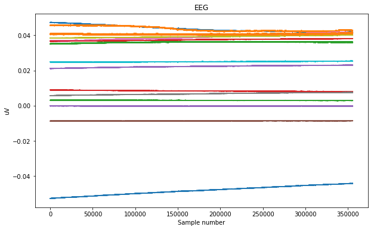

# EEG data preprocessing - Reading from SD Card and Filtering
The preprocessing step is critical to good classification.

The first step is to read the OpenBCI SD card files and to save the data in numpy arrays. We wrote a simple function to read in the OBCI Hex file created by the Cyton board (`loadOBCIHexFile()`).  This function reads the file does the hex to decimal conversion and does some simple integrity checks to test for the most common faults in the file.

Then the initial filtering prepares and cleans the EEG data for the analysis step.  Later during the analysis phase we will may additional filtering during the 'feature extraction' step.

We have two primary goals for the filtering:
1. remove the steady-state DC bias between the signals
1. remove the all frequencies greater than 40Hz, in particular the 60Hz (or 50Hz in some countries) contamination that results from electric mains

## A note on bi-directional filtering
Many of the examples available online use bi-directional filters. They do this because the resulting signal has very little phase shift. You cannot do that  when you want to do real-time "thought" classifications. You can think of it this way: Filtering data forward (left-to-right) will shift the resulting signal slightly to the right.  Then filtering backwards (right-to-left) shifts the resulting signal the same amount to the left.  The resulting signal is phase neutral. This cannot work in real-time classification because we don't have the future signal. For this reason we had to design our own filters to filter the data as it streamed in.  The resulting signal is offset to the right, but since we are only interested in the frequency content of the signals this is not a problem.

We used the signal processing fuctions from the `scipy.sig` module, in particular the `butterworth` filter package.


# Imports


```python
#imports
import numpy as np
import matplotlib.pyplot as plt
from scipy.misc import imread
from scipy import signal as sig
import csv
import sys, math
#%matplotlib notebook
```

## Custom Functions to extract EEG from SD Card files and filtering


```python
# Constants
EEG_CONVERSION = 4.5 / ((float)(pow(2, 23)-1)) /24  #this converts to volts
SEX_FEMALE = 2
SEX_MALE = 1
HANDEDNESS_RIGHT = 1
HANDEDNESS_LEFT = 2

# Functions

# this converts a 24 bit hexadecimal number to a python floating point
# this function was copied from the OpenBCI website
def rawhex2float(hexnum):    
    newInt = int(hexnum,16)
    if ((newInt & 0x800000) > 0):
        newInt = -1*(2**23-(newInt & 0x7FFFFF))    
    return float(newInt)


# this is the function that loads the OBCI_xx.TXT file 
# since some of the files were corrupted we need to do many checks before we read
# the data in
def loadOBCIHexFile(hexFileName):
    hexFile = open(hexFileName, 'r')
    reader = csv.reader(hexFile)  # create a CSV reader
    line = next(reader)  #skip the first line - it has no info
    while (line[0] != '%STOP AT'):
        print("Incomplete file - does not begin with %STOP AT")
        line = next(reader)
    
    print("Found %STOP AT")

    line = next(reader)  #read the second line it may have info
    stopAt = int(line[0], 16)
    
# see how many channels the file contains and set variables
    line = next(reader)  # read the first line to find out the number of colums
    
    numCols = len(line)
    
    if (numCols >12):
        numEEGChan = 16
        numAuxChan = 3
    else:
        numEEGChan = 8
        numAuxChan = 3
    
    print("Number of EEG channels: {}".format(numEEGChan))

    lineCounter = 0  #this is the counter we will add to the lines
    lastNumCols = 0
    floatDataList =[]

    try:
        for line in reader:
            newline = []
            columncount = 0
            
            # a line is only valid if it contains 20 columns and if the previous line also contained
            # 20 columns - this is to block the Accelerometer mode format that sends 20 columns
            # every 25 rows and 17 columns the rest of the time
            if (len(line) == numCols and lastNumCols == numCols):  
            
                try:
                    for col in line:
                    #print("Col is : {} of type {}".format(col, type(col)))
                        if (columncount==0):
                            newline.append(np.float32(int(col,16)))
                        elif (columncount <= numEEGChan):
                            newline.append(rawhex2float(col)*EEG_CONVERSION)
                        else:
                            newline.append(np.float32(int(col,16)))

                        columncount=columncount+1
                except:
                    print("Found non number")
                else:
                    floatDataList.append(newline)
                    lineCounter = lineCounter+1
            lastNumCols = len(line)

    except:
        print("End of file found at {} lines".format(lineCounter))

    floatData = np.asarray(floatDataList) # create a numpy array from the list of data
    del(floatDataList)
    mask = np.ones(floatData.shape[1], dtype=bool)
    mask[[0,numEEGChan+2,numEEGChan+3]]=False
    floatData = floatData[:,mask]
    return floatData


# The standard MNE remove bias function did not completely remove low frequency bias
# some of the papers we read suggested a butterworth filter
# we tested different cutoff frequencies and 0.001 seemed to work well
def removeOBCIBias(data, butter_order=3, butter_cutoff=0.001):
    '''A function to remove the DC bias from the raw EEG signals
    using a simple butterworth filter. The filter does not alter
    the last channel, which is the marker channel. We tested 
    different cutoff values and 0.001 seemed to work well with
    1000Hz sampling rates
    
    Parameters:
    data: \ta numpy array shape(n_samples, n_channels+1) with the data
    butter_order: \tthe order of the butterworth filter (default = 3)
    butter_cutoff: \tthe cutoff frequency of the butterworth filter (default = 0.001)'''
    num_cols = data.shape[-1]
    #temp_data = np.zeros(data.shape)
    if (num_cols > 12):
        n = 16
    else:
        n = 8
        
    print("Found {} columns of EEG data to de-bias".format(n))
    
    # This creates the filter and returns a and b lists
    b,a = sig.butter(butter_order,butter_cutoff)
    
    for i in range(0, n):
        z = sig.filtfilt(b,a,data[:,i])  # this applies the filter using 
        zz = sig.filtfilt(b,a,z)  # this applies the filter a second time 
        data[:,i] -= zz
    
    # this line copies the maker data from data to into the return array
    #temp_data[:,n] = data[:,n]
    return data

# This function finds the markers in a data set
# We use to check that the data has markers in it
def findMarkers(array, num_eeg_chan=-1):
    markers = []
    col = num_eeg_chan
    count = 0
    for row in array:
        count = count+1
        if (row[col] != 0):
            markers.append(row[col])
    print("Number of rows scanned: {}".format(count))
    return markers

# This function finds the location of the first marker in the data set
# We use to find the begining of the valid data since the first few minutes of
# data is usually junk as we position the headset and check the probe resistances
def findStartMarker(array, num_eeg_chan=-1):
    markers = []
    col = num_eeg_chan
    count = 0
    for row in array:
        count = count+1
        if (row[col] != 0):
            break
            
    print("First marker found at row: {}".format(count))
    return count
        
```

# Step 1: Load the files

This is done with the loadOBCIHexFile( filename ) command.

`loadOBCIHexFile()` returns a numpy array with the EEG channels and the marker channel at the end


```python
dat =loadOBCIHexFile(
    '/Users/gerrie/Google Drive/ScienceFair-2017/GIT Hub/data/rawdata/Jacqui MotionThoughts Ankles-Elbows OBCI_FD.TXT')

```

    Found %STOP AT
    Number of EEG channels: 16
    End of file found at 515932 lines


```python
# Remove all the data preceding 10s (10*1000samples/sec) before the first marker 
first_marker = findStartMarker(dat)
dat = dat[first_marker-10000:,:]
```

    First marker found at row: 170438


Check the size of the data - for 16 channels there should be 16 eeg + 1 marker = 17 columns


```python
dat.shape
```


    (355494, 17)


# Step 2 - Inspect the EEG Data


```python
# plot the data to check it looks good
plt.close()
plt.figure(figsize=(10,6))
plt.plot(dat[:,0:15])
plt.title('EEG')
plt.xlabel('Sample number')
plt.ylabel('uV')
plt.show()
```





### Bias / DC / Low frequencies
The plot above clearly shows the DC bias between the different EEG signals.  The bias is orders of magnitude greater than the signals, so much so that the signals are not visible. The chart below zooms in on the purple signal to confirm that there is a signal there


```python
# plot the data to check it looks good
plt.close()
plt.figure(figsize=(10,6))

plt.plot(dat[72800:73800,0:15])
plt.title('EEG - Zoomed In [72800:73800]')
plt.xlabel('Sample number')
plt.ylabel('uV')
plt.ylim((-0.0005,0.0))
plt.show()
```


# Step 3: Remove the DC (low frequencies)

The first figure above shows that the data looks very good but that it has significant bias between the different channels.  To make sense of the data we need to remove this low-fequency bias.  Our review of literature showed that most researchers used a Butterworth filter.


```python
# copy the data into a new Numpy array
dat3 = np.zeros(dat.shape)
np.copyto(dat3, dat)
# removeOBCIBias is a function defined above to simplify the filtering
dat3 = removeOBCIBias(dat3, butter_order=3, butter_cutoff=0.002)
```

    Found 16 columns of EEG data to de-bias


### After DC Bias removal
The plot below shows all 16 channels after bias removal.  Many of the signals are invisible as they are hidden behind the orange signal.

The second plot shows the extent of 60Hz noise.  We will deal with that next.


```python
plt.close()
plt.figure(figsize=(10,8))
plt.subplot(2,1,1)
plt.plot(dat3[:,0:15])
plt.title('EEG and Markers')
plt.ylabel('EEG [uV]')

plt.subplot(2,1,2)
plt.plot(dat3[100000:100250,0:15])
plt.title('EEG and Markers - Zoomed in 250 samples')
plt.ylabel('EEG [uV]')
plt.show()


```


### Now check for the markers
The markers are in the last column of the array (index=16)


```python
plt.close()
plt.figure(figsize=(10,8))
plt.subplot(2,1,1)
plt.plot(dat3[:,0:15])
plt.title('EEG and Markers')
plt.ylabel('EEG [uV]')
plt.subplot(2,1,2)
plt.plot(dat3[:,16])
plt.xlabel('Sample number')
plt.ylabel('Marker')
plt.show()
```


### Zoom in to see the 60Hz noise

The signals have been debiased, but now the 60Hz noise is evident.  We need to remove this


```python
plt.close()
plt.figure(figsize=(10,6))
plt.plot(dat3[36800:37000,:15])
plt.title('EEG and Markers')
plt.xlabel('Sample number')
plt.ylabel('EEG [uV]')
plt.show()

```


# Step 4: Remove the 60Hz

We tried using special 60Hz notch filters (Here is the [documentation](https://docs.scipy.org/doc/scipy-0.19.1/reference/generated/scipy.signal.iirnotch.html)) but they seemed to introduce 'chirps' in the data at regular intervals. We never determined the exact reason, but we think the filters are only marginally stable and would freak out every few seconds.  

In the end we resorted to a low-pass butterworth filter to block all the high frequencies.

The follwing cells are just to illustrate the problem with the notch fiters


```python
fs = 1000.0
f0 = 60
Q = 30  # Quality factor==
w0 = f0/(fs/2)  # Normalized Frequency
# Design notch filter
b, a = sig.iirnotch(w0, Q)
```


```python
datf = np.zeros(dat.shape)
zi = sig.lfilter_zi(b, a)
for i in range(16):
    datf[:,i], _ = sig.lfilter(b, a, dat3[:,i], zi=zi*dat3[:,i][0])
datf[:,16] = dat3[:,16]
```


```python
# Frequency response
w, h = sig.freqz(b, a)
# Generate frequency axis
freq = w*fs/(2*np.pi)
# Plot
fig, ax = plt.subplots(2, 1, figsize=(8, 6))
ax[0].plot(freq, 20*np.log10(abs(h)), color='blue')
ax[0].set_title("Frequency Response")
ax[0].set_ylabel("Amplitude (dB)", color='blue')
ax[0].set_xlim([0, 100])
ax[0].set_ylim([-25, 10])
ax[0].grid()
ax[1].plot(freq, np.unwrap(np.angle(h))*180/np.pi, color='green')
ax[1].set_ylabel("Angle (degrees)", color='green')
ax[1].set_xlabel("Frequency (Hz)")
ax[1].set_xlim([0, 100])
ax[1].set_yticks([-90, -60, -30, 0, 30, 60, 90])
ax[1].set_ylim([-90, 90])
ax[1].grid()
plt.show()
```


```python
plt.close()
plt.figure(figsize=(10,8))
plt.subplot(411)
plt.plot(datf[:10000,11])
plt.title("After 60Hz notch filter [Volts] Ch =[11,5,1,12]")
plt.subplot(412)
plt.plot(datf[:10000,6])
plt.subplot(413)
plt.plot(datf[:10000,1])
plt.subplot(414)
plt.plot(datf[:10000,12])
plt.xlabel('Sample number')
plt.ylabel('EEG [Volts]')
plt.show()
plt.show()
```


These artifacts appear on many of the channels, but are more pronounced on some channels.  Let's zoom in....


```python
plt.close()
start=2000;
end=3000;
samples=range(start, end)
plt.figure(figsize=(10,6))
plt.plot(samples, datf[start:end,11])
plt.title("Zoomed in - After 60Hz notch filter [Volts]")
plt.xlabel('Sample number')
plt.ylabel('EEG [Volts]')
plt.show()
plt.show()
```


```python
plt.close()
start=2200;
end=2400;
samples=range(start, end)
#plt.plot(dat3[1:2000,11])
plt.plot(samples, datf[start:end,11])
plt.title("Zoomed in - After 60Hz notch filter [Volts]")
plt.xlabel('Sample number')
plt.ylabel('EEG [Volts]')
plt.show()
plt.show()
```


Is this caused by discontinuities in the raw data or is is merely a problem with the filter?


```python
plt.close()
start=2200;
end=2400;
samples=range(start, end)
plt.close()
plt.figure(figsize=(10,8))
plt.subplot(211)
plt.plot(samples,datf[start:end,11])
plt.title("After 60Hz notch filter and Raw data[Volts] - Ch 11")
plt.subplot(212)
plt.plot(samples,dat[start:end,11])
plt.xlabel('Sample number')
plt.ylabel('EEG [Volts]')
plt.show()
plt.show()
```


Does not look like there is a clear problem in the data - but these notch filters are quite unstable and jitters in the data can trigger one of these cycles. 

But is seems unlikely that all channels would have these chirps at exactly the same time?

Need to look futher.  

What if the data is cropped by 1000 samples.  Will the Chirp still in the same position?  If it is, it is not merely a filter issue, but a problem in the data


```python
short_dat3 = dat3[1000:,:]
short_dat3.shape
```


    (354494, 17)


```python
short_datf = np.zeros(short_dat3.shape)
zi = sig.lfilter_zi(b, a)
for i in range(16):
    short_datf[:,i], _ = sig.lfilter(b, a, short_dat3[:,i], zi=zi*short_dat3[:,i][0])
short_datf[:,16] = short_dat3[:,16]
```


```python
plt.close()
plt.figure(figsize=(10,8))
plt.subplot(411)
plt.plot(short_datf[:10000,11])
plt.title("After 60Hz notch filter [Volts] Ch =[11,5,1,12]")
plt.subplot(412)
plt.plot(short_datf[:10000,6])
plt.subplot(413)
plt.plot(short_datf[:10000,1])
plt.subplot(414)
plt.plot(short_datf[:10000,12])
plt.xlabel('Sample number')
plt.ylabel('EEG [Volts]')
plt.show()
plt.show()
```


Now for the test, did the Chirp move exactly 1000 points to the left?


```python
plt.close()
start=1000;
end=2000;
samples=range(start, end)
#plt.plot(dat3[1:2000,11])
plt.figure(figsize=(10,6))

plt.plot(samples, datf[start:end,11])
plt.title("Zoomed in - After 60Hz notch filter [Volts]")
plt.xlabel('Sample number')
plt.ylabel('EEG [Volts]')
plt.show()
plt.show()
```


And the answer is NO - not a problem with the raw data - a problem with the filter.
Now back to the main process of filtering the signals.

## Looking at the frequency content of the signals
Fourier transforms convert the signals from the time domain to the frequency domain. The resulting plot shows the prevalence of the different frequencies in Hz.  The peak at 60Hz is clear as well as the multiples of 60Hz (120, 180, 240).


```python
from scipy.fftpack import fft
# Number of sample points
N = dat3.shape[0]
# sample spacing
T = 1.0 / 1000.0

y = dat3[:,11]
yf = fft(y)
xf = np.linspace(0.0, 1.0/(2.0*T), N//2)
plt.figure(figsize=(10,6))

plt.title("Fourier Transfrom of EGG data")
plt.xlabel('Frequency [Hz]')
plt.ylabel('Frequency Content')
plt.plot(xf, 2.0/N * np.abs(yf[0:N//2]))
plt.grid()
plt.show()
```


```python
plt.figure(figsize=(10,6))

plt.title("Fourier Transfrom of EGG data - Zoomed in to 60Hz")
plt.xlabel('Frequency [Hz]')
plt.ylabel('Frequency Content')
plt.plot(xf[21300:21400], 2.0/N * np.abs(yf[0:N//2])[21300:21400])
plt.grid()
plt.show()
```


#### The center of the power noise is not 60Hz but actually two peaks at 60.09 and 60.075

Let's take a look at an 8th-order butterworth filter 30 rad/sec cutoff 


```python
plt.close()
plt.figure(figsize=(10,6))

b, a = sig.butter(8, 30/(2*np.pi), 'low', analog=True)
w, h = sig.freqs(b, a)
plt.plot(w*2*np.pi, 20 * np.log10(abs(h)))
plt.xscale('log')
plt.title('Butterworth filter frequency response')
plt.xlabel('Frequency [Hz]')
plt.ylabel('Amplitude [dB]')
plt.margins(0, 0.1)
plt.grid(which='both', axis='both')
plt.axvline(100, color='green') # cutoff frequency
plt.show()
```


```python
fs = 1000.0
f0 = 45
Wn = f0/(fs/2)  # Normalized Frequency
# Design filter
butter_b, butter_a = sig.butter(8, Wn, btype='low', analog=False)
```


```python
datbf = np.zeros(dat3.shape)
zi = sig.lfilter_zi(butter_b, butter_a)
for i in range(16):
    datbf[:,i], _ = sig.lfilter(butter_b, butter_a, dat3[:,i], zi=zi*dat3[:,i][0])
datbf[:,16] = dat3[:,16]
```


```python
plt.close()
plt.figure(figsize=(10,8))
plt.subplot(211)
plt.plot(datbf[63700:64200,5])
plt.title("Signal 5: After 40Hz Butterworth and Raw signal")
plt.ylabel('EEG [Volts]')
plt.subplot(212)
plt.plot(dat[63700:64200,5])
plt.ylabel('EEG [Volts]')
plt.xlabel('Sample number')
plt.show()
```


#### Look at the frequency content
The 60Hz is less, but still to big


```python
# Number of sample points
N = datbf.shape[0]
# sample spacing
T = 1.0 / 1000.0

plt.close()
plt.figure(figsize=(10,6))
y = datbf[:,5]
yf = fft(y)
xf = np.linspace(0.0, 1.0/(2.0*T), N//2)
plt.plot(xf, 2.0/N * np.abs(yf[0:N//2]))
plt.title("Fourier Transfrom of EGG data")
plt.xlabel('Frequency [Hz]')
plt.ylabel('Frequency Content')
plt.grid()
plt.show()
```


### Apply Notch filter after low-pass butterworth filter
Unfotunately we cannot just apply a stronger butterworth filter as we may lose important frequencies in the 30Hz range. After much experimentation we tried using a notch filter after the initial butterworth filter and it worked very well.


```python
fs = 1000.0
f0 = 60.1
Q = 1.5  # Quality factor==
w0 = f0/(fs/2)  # Normalized Frequency
# Design notch filter
b, a = sig.iirnotch(w0, Q)
datnf = np.zeros(dat.shape)
zi = sig.lfilter_zi(b, a)
for i in range(16):
    datnf[:,i], _ = sig.lfilter(b, a, datbf[:,i], zi=zi*datbf[:,i][0])
datnf[:,16] = datbf[:,16]
```

Great, this completely removed the 60Hz noise and there are no 'chirps' 


```python

# Number of sample points
N = datnf.shape[0]
# sample spacing
T = 1.0 / 1000.0

plt.close()
plt.figure(figsize=(10,6))
y = datnf[:,5]
yf = fft(y)
xf = np.linspace(0.0, 1.0/(2.0*T), N//2)
plt.plot(xf, 2.0/N * np.abs(yf[0:N//2]))
plt.title("Fourier Transfrom of EGG data")
plt.xlabel('Frequency [Hz]')
plt.ylabel('Frequency Content')
plt.grid()
plt.show()
```


```python
plt.close()
plt.figure(figsize=(10,8))
plt.subplot(411)
plt.plot(datbf[10000:20000,11])
plt.title("After 40Hz Butterworth filter [Volts] Ch =[11,5,1,12]")
plt.subplot(412)
plt.plot(datbf[10000:20000,6])
plt.subplot(413)
plt.plot(datbf[10000:20000,1])
plt.subplot(414)
plt.plot(datbf[10000:20000,12])
plt.xlabel('Sample number')
plt.ylabel('EEG [Volts]')
plt.show()
plt.show()
```


```python
plt.close()
plt.figure(figsize=(10,8))
plt.subplot(411)
plt.plot(datnf[10000:20000,11])
plt.title("After 40Hz Butterworth and 60Hz IRR Notch filter [Volts] Ch =[11,5,1,12]")
plt.subplot(412)
plt.plot(datnf[10000:20000,6])
plt.subplot(413)
plt.plot(datnf[10000:20000,1])
plt.subplot(414)
plt.plot(datnf[10000:20000,12])
plt.xlabel('Sample number')
plt.ylabel('EEG [Volts]')
plt.show()
plt.show()
```


```python
plt.close()
plt.figure(figsize=(10,6))
plt.title("After 40Hz Butterworth (blue) and after additional 60Hz IRR Notch filter (orange) [Volts] Ch =[11]")
plt.xlabel('Sample number')
plt.ylabel('EEG [Volts]')
plt.plot(datbf[10000:10500,11])
plt.plot(datnf[10000:10500,11])

plt.show()

```


# Conclusion
After much experimentation we found that a Butterworth filter (8th-order, 40Hz) followed by a 60.1Hz Notch filter worked the best to clean up the raw EEG data. We used this for the data preprocessing
